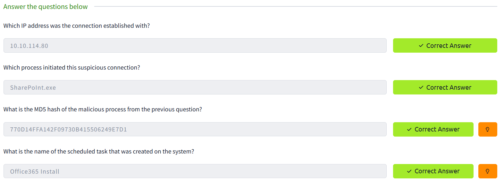
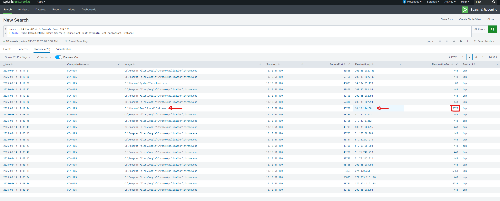
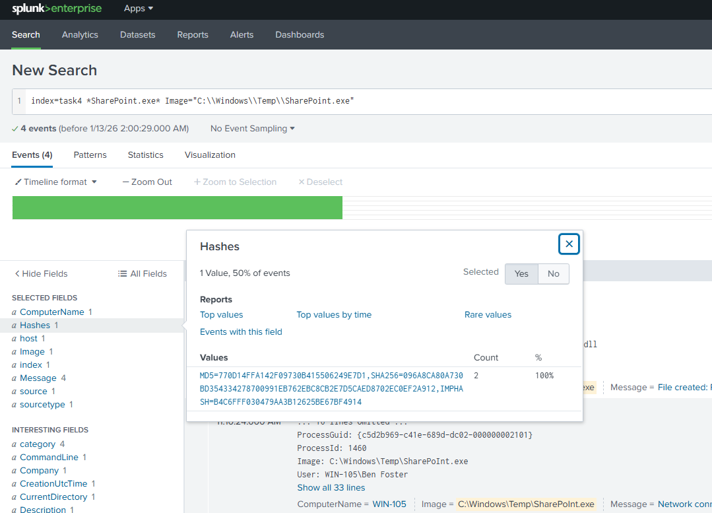
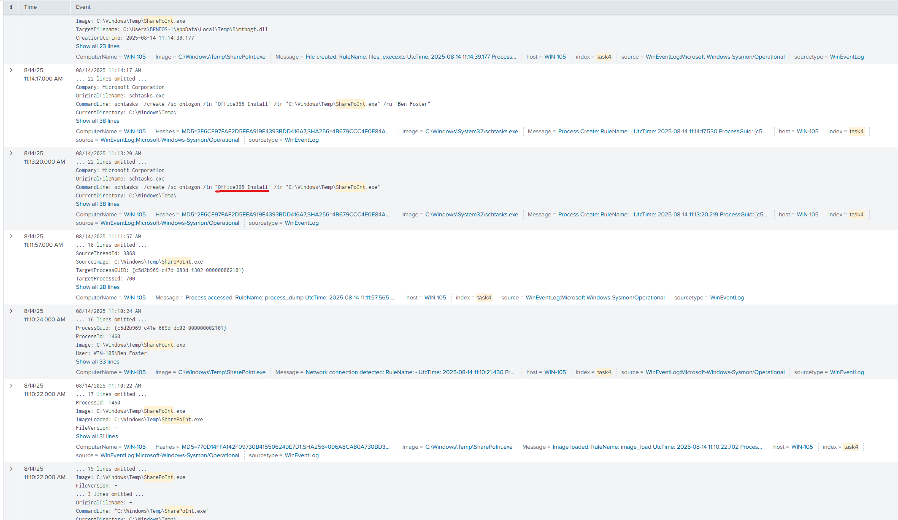
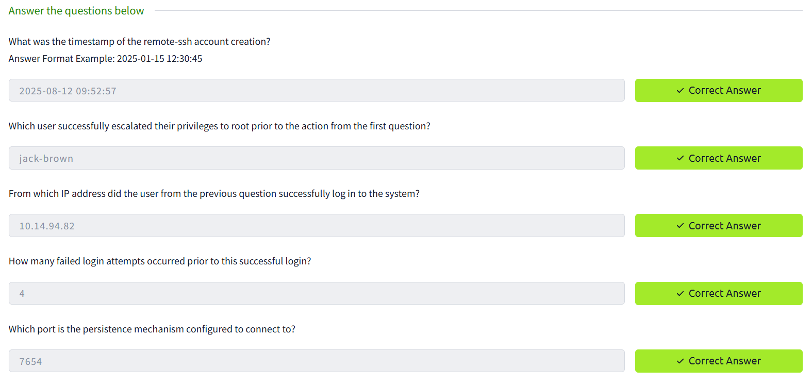
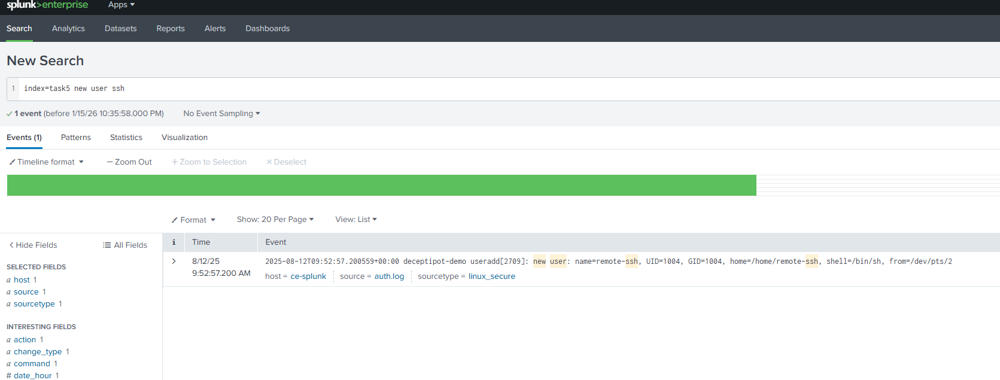
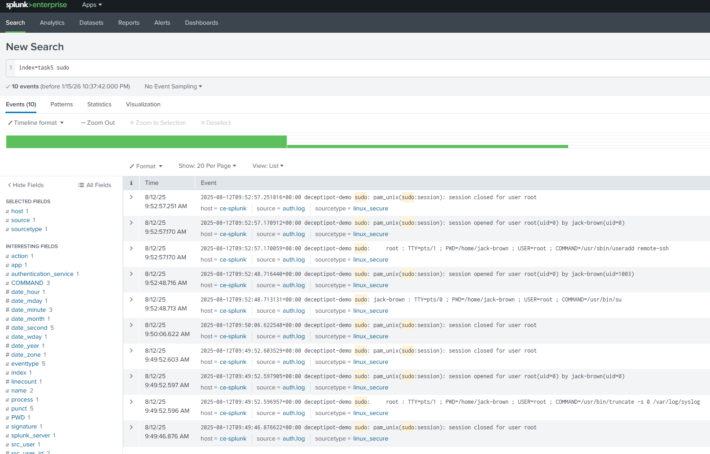
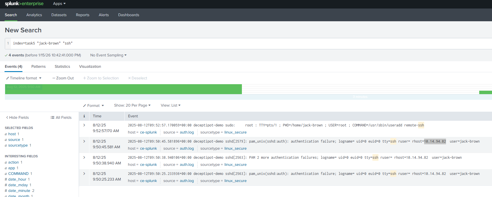
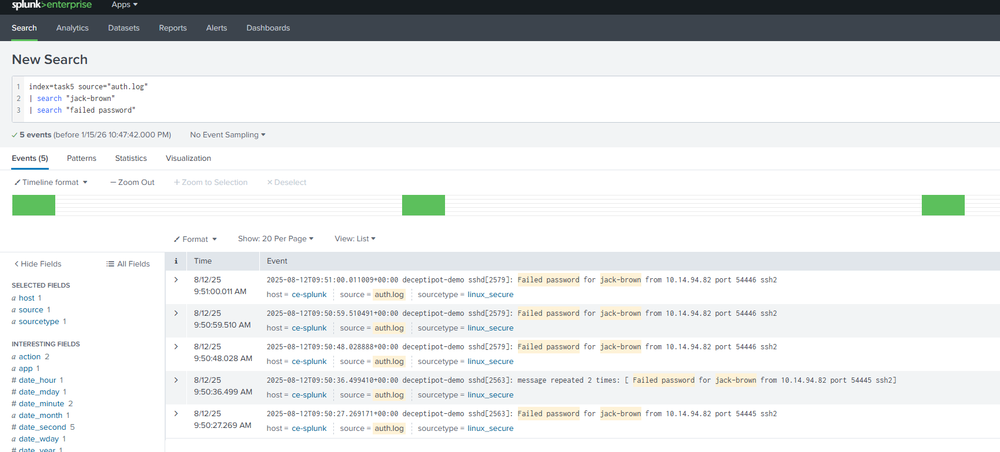
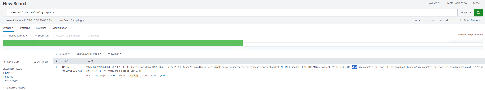

## Log Analysis with SIEM
**Platform:** TryHackMe

### Task 4 - Windows Logs
### Practice Scenario

As a SOC Level 1 Analyst on shift, I received an alert about a suspicious network connection on port 5678 from the host WIN-105. My task was to investigate the activity using Windows logs in the SIEM and determine whether it was suspicious or required escalation.

### Questions 1 & 2 – Destination IP and Initiating Process

**Questions:**  
- Which IP address was the connection established with?  
- Which process initiated this suspicious connection?

**Investigation approach:**  
I checked the network logs for port 5678 on WIN-105 to find the destination IP and the process that initiated the connection.

### Question 3 – MD5 Hash of Malicious Process

**Question:**  
What is the MD5 hash of the malicious process from the previous question?

**Investigation approach:**  
I filtered 'sharepoint.exe' to check for the MD5 hash

### Question 4 – Scheduled Task Name

**Question:**  
What is the name of the scheduled task that was created on the system?

**Investigation approach:**  
I looked at the details from the previous event and checked the Windows logs to find the name of the scheduled task.

---

### Task 5 - Linux Logs
### Practice Scenario

As an SOC Level 1 Analyst on shift, I received an alert indicating possible persistence activity on an Ubuntu server. The alert suggested that a new remote SSH user may have been created. My task was to investigate the system activity using Linux logs in the SIEM and determine what actions occurred and whether the behavior was suspicious.

### Question 1: Timestamp of Account Creation

**Question:**  
What was the timestamp of the remote-ssh account creation?

**Investigation approach:**  
I filtered for SSH account creation events to identify exactly when the new user was added.

### Question 2: User Escalation

**Question:**  
Which user successfully escalated privileges to root prior to the action from the first question?

**Investigation approach:**  
I filtered the logs for 'sudo' events

### Question 3: Source IP Address

**Question:**  
From which IP address did the user from the previous question successfully log in to the system?

**Investigation approach:**  
I filtered for 'jack-brown' 'ssh' to find the source IP address of the successful login.

### Question 4: Failed Login Attempts

**Question:**  
How many failed login attempts occurred before the successful login?

**Investigation approach:**  
I filtered for "failed passwords"

### Question 5: Persistence Port

**Question:**  
Which port is the persistence mechanism configured to connect to?

**Investigation approach:**  
I filtered for 'port' and source='syslog'

---

### Task 6 - Web Application Logs
### Practice Scenario

As a SOC Level 1 Analyst on shift, I received an alert indicating a spike in activity on the organization’s web server. My task was to investigate the web server logs in the SIEM to determine what happened and whether the activity was malicious.

### Question 1: URI Path with Highest Requests

**Question:**  
Which URI path had the highest number of requests?

**Investigation approach:**  
I used the query provided in the lab to search the web server logs and identify which URI path had the most requests.

### Question 2: Source IP Address

**Question:**  
Which IP address was the source of the activity?
**Answer:** 
10.10.243.134

### Question 3: Activity Classification

**Question:**  
How can this activity be classified?
**Answer:**  Brute Force

### Question 4: Tool Used

**Question:**  
Which tool did the threat actor use?
**Answer:**
WPScan
