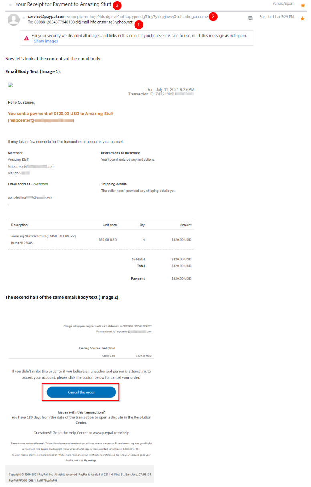
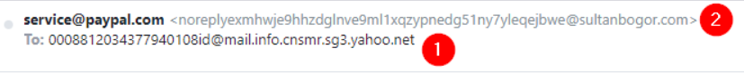
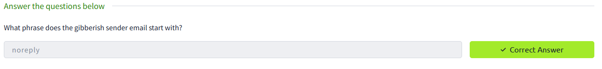

## Phishing Emails in Action
**Platform:** TryHackMe

### Phishing Email Analysis – Example 1 (Cancel your PayPal order)

**Task context:**  
A suspicious email claiming to be from PayPal instructed the recipient to cancel an order.

**Indicators observed:**
- Sender email starts with **"noreply"**, which is commonly abused in phishing emails
- Urgent language urging immediate action
- Claims to be from PayPal but lacks legitimate verification

**Verdict:** Phishing

**SOC Level 1 Action:**  
Document findings and escalate to Tier 2 for further handling.

**Screenshots:**
- Email content:

- Sender address: :

- Task answer submission:

